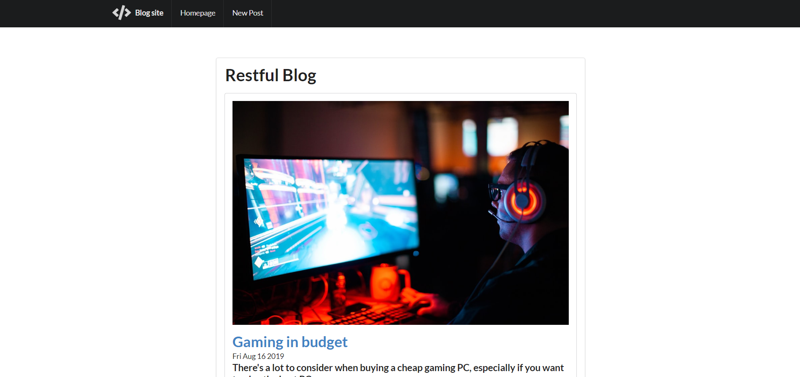
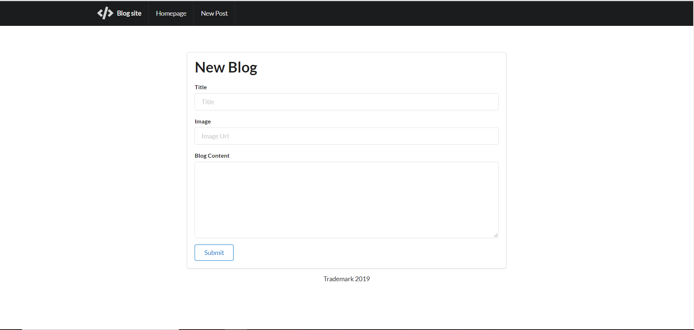
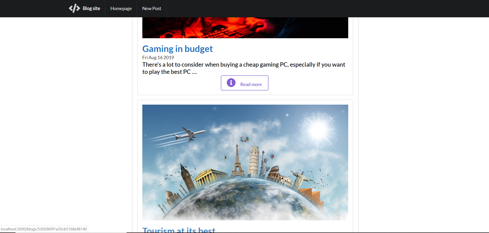

# Practice-Blog
Simple blogging website with application of Semantic UI instead of Bootstrap.I wanted to learn Semantic UI and wanted to create a simple blog to start ,might create Blogging site in future.

## To Run the code
* Clone the Repository
* In console `npm install express`
* In console `node app.js`
* Open browser and enter url `http://localhost:3000/`

### SCREENSHOTS
* This is Homepage

* This New blog page

* Seperate blocks have been made for each blog 

